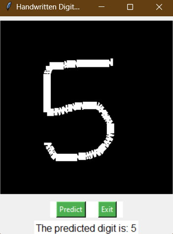

# Computer Vision Projects

This repository contains various cv projects. Below is a brief description of each project:

## Contents
- [Digit Recognition](#digit-recognition)
- [Misc Deep Learning](#misc-deep-learning)
- [Graph-Cut Segmentation](#graph-cut-segmentation)
- [Hough Transform](#hough-transform)
- [Image Stitcher](#image-stitcher)

## Digit Recognition

### Description
This project implements a digit recognition system using a Convolutional Neural Network (CNN). It includes a graphical user interface (GUI) where users can draw a digit, and the system predicts the drawn digit.

### Example Output Image

### Files
- `digit_writer.py`: Tkinter application for drawing digits and predicting them from the network.
- `digit_recognition.pt`: Pre-trained CNN model for digit recognition.
- `MNIST_CNN.ipynb`: Jupyter notebook with code to develope the digit recognition model and train the network.
- `handwritten_digit.png`: Place holder image for images created from the gui.

## Misc Deep Learning

### Description
This folder contains misc projects based on computer vision deep learning such as cellular cancer detection and transfer learing for image classification.

### Example Output Image

### Files
- `cancer_detection.ipynb`: Jupyter notebook containing a self implemented U-Net CNN architecture for cancer imaging.
- `transfer_learning.ipynb`: Jupyter notebook containing a transfer learning example for image classification on the intel dataset with unfreezing implemented.

## Graph-Cut Segmentation

### Description
This project implements graph-cut segmentation, a technique for image segmentation. It provides a clean and finalized implementation of the algorithm.

### Example Output Image

### Files
- `segmentation.ipynb`: Jupyter notebook containing graph-cut algorithm.
- `gui_seg.py`: Tkiner application for chosing foreground and background pixels to calculate pixel distribution.
- `provided_images`: Folder of images used for segmentaiton with their associated ground truth mask. 

## Hough Transform

### Description
This project implements the Hough Transform algorithm for detecting circles in images. It includes a personally implemented version of the algorithm.

### Example Output Image

### Files
- `hough_transform.ipynb`: Jupyter notebook with hough transform implementation for various images. Canny edge detector is also implemented here.
- `Images`: Various images for extracting gradient magnitude from as well as cirlce detection examples.

## Image Stitcher

### Description
This project implements an image stitching algorithm to combine multiple overlapping images into a panoramic image. It includes fixes for output errors.

### Example Output Image

### Files
- `image_stitching.ipynb`: Jupyter notebook containing image mosaic implementation based on OpenCV with SIFT and Ransac.
- `Images`: Images to be stitched together.
